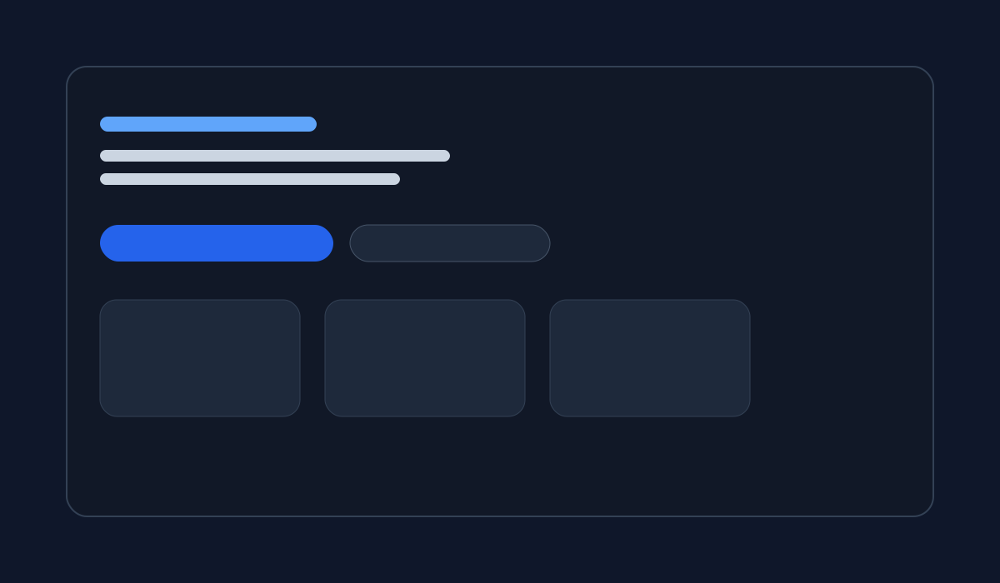

# My GitHub Project

This project is a simple starter page that you can edit in VS Code, update the README, and push to GitHub.

## Features
- Clean landing page
- Easy to customize
- Ready for GitHub hosting or local preview

## Preview

## How to run locally
1. Open the project folder in VS Code.
2. Open [index.html](index.html).
3. Right-click the file and choose Open with Live Server, or open it in your browser.

## How to push to GitHub
1. Open the Source Control panel in VS Code.
2. Stage your changes.
3. Commit with a message such as "Initial project setup".
4. Click Push.

## Files
- [index.html](index.html)
- [styles.css](styles.css)
- [README.md](README.md)
